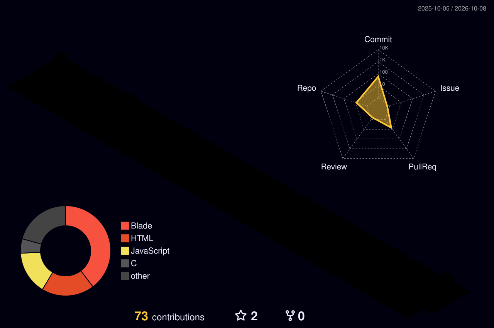

<!-- ===================== HEADER (animated wave) ===================== -->
<div align="center">


<!-- Typing animation -->
<a href="https://github.com/Hari016">
  
</a>

<br/>


</div>

---

## 👨‍💻 About Me

<table>
<tr>
<td width="60%">

I'm a **Full Stack Developer** who enjoys turning ideas into clean, fast and scalable web applications.

- 🔭 Currently building web projects with **Laravel, PHP & MySQL**
- 🌱 Learning **advanced frameworks and cloud technologies (AWS)**
- 🤝 Open to **collaboration and open-source** contributions
- 💬 Happy to talk about programming, design and innovation
- ⚡ Fun fact: I debug faster after a cup of tea ☕

</td>
<td width="40%" align="center">


</td>
</tr>
</table>

---

## 🛠️ Tech Stack

<div align="center">

**Languages**


**Web & Backend**


**Database, Cloud & Tools**


</div>

---

## 📊 GitHub Analytics

<div align="center">


</div>

---

## 🧊 3D Contribution Graph

<div align="center">

<!-- Generated by the 3D workflow (see .github/workflows/profile-3d.yml) -->


</div>

---

## 🐍 Contribution Snake

<div align="center">

<!-- Generated by the snake workflow (see .github/workflows/snake.yml) -->
<picture>
  <source media="(prefers-color-scheme: dark)" srcset="https://raw.githubusercontent.com/Hari016/Hari016/output/github-snake-dark.svg" />
  <source media="(prefers-color-scheme: light)" srcset="https://raw.githubusercontent.com/Hari016/Hari016/output/github-snake.svg" />
  
</picture>

</div>

---

## 🚀 Featured Projects

| Project | Description | Tech |
|---|---|---|
| 🔹 **Project One** | Short one-line description of what it does | `Laravel` `MySQL` |
| 🔹 **Project Two** | Short one-line description of what it does | `PHP` `JavaScript` |
| 🔹 **Project Three** | Short one-line description of what it does | `Java` `C++` |

> ✏️ Replace these rows with your real projects and link each name to its repository.

---

## 🎯 Current Focus

```text
Backend architecture   ████████████░░░░  Laravel & APIs
Cloud                  ████████░░░░░░░░  AWS fundamentals
Open source            ██████░░░░░░░░░░  Finding projects to contribute to
```

---

## 🌐 Let's Connect

<div align="center">

<a href="https://www.linkedin.com/in/hari-thagunna-336997295"></a>
<a href="mailto:harithagunna829@gmail.com"></a>
<a href="https://www.facebook.com/HariT016"></a>
<a href="https://www.instagram.com/harithagunna829"></a>
<a href="https://www.tiktok.com/@harithagunna6"></a>

<br/><br/>


</div>


